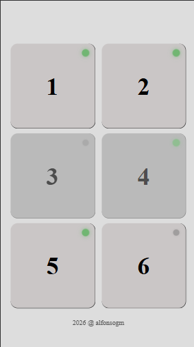

### Apps Status

Panel sencillo para visualizar el estado de diferentes páginas web.

La interfaz permite identificar rápidamente si un servicio está **activo** o **inactivo** mediante indicadores visuales de estado.

## Captura

  

